  

---

## `$ cat whoami.txt`

<pre><code>Name  ──  Mesya (mesy4)
Role  ──  Security Operations Analyst
          formerly Software Engineer
Edu   ──  Master's Degree in Cyber Security
Focus ──  Incident Response  |  Threat Hunting  |  Memory Analysis</code></pre>

---

## `$ ls skills/`

**Defensive & Analysis**

 

**Languages & Tools**

---

## `$ cat stats.out`

  
  

---

## `$ ./play_snake.sh`

  <picture>
    <source media="(prefers-color-scheme: dark)" srcset="https://raw.githubusercontent.com/mesy4/mesy4/output/github-contribution-grid-snake-dark.svg">
    <source media="(prefers-color-scheme: light)" srcset="https://raw.githubusercontent.com/mesy4/mesy4/output/github-contribution-grid-snake-dark.svg">
    
  </picture>

---

## `$ ls -la public_projects/`

*(Click below to expand file contents)*

<code>📄 cat dl-fileless-malware-memory-analysis.md</code>

 

**[dl-fileless-malware-memory-analysis](https://github.com/mesy4/dl-fileless-malware-memory-analysis)**
> Implementation of deep learning models (ANN, CNN, and RNN) for detecting fileless malware via memory dump analysis. Includes exploratory data analysis and comparative performance metrics (ROC, Confusion Matrix).
>
> 
> 
> 

---

## `$ mail -s "Let's Connect" root@localhost`

  

